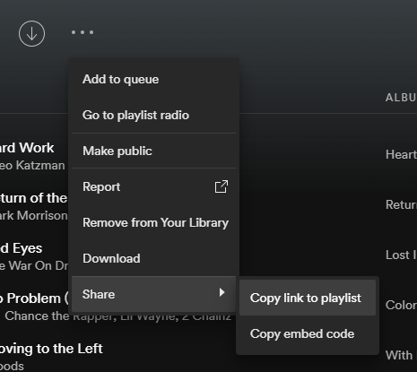
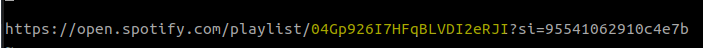
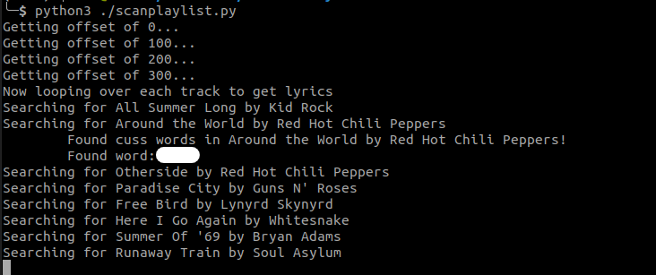

# kidfriendly
A little script I wrote to check a playlist for cuss words. This year, my kid is having her first outdoor birthday party in which we invite a bunch of her friends and their parents over. Since I've never met any of them, I want to make a good first impression, and as we all know, outdoor parties always need some sort of music. I have a really good outdoor playlist of just generic background music, but not all of that music is kid friendly. Some of it is downright vulgar. Perfectly fine for grilling with a few beers, but not so great when children are running around.

I wrote this script to scan a spotify playlist, query every song it gets for its lyrics, and then check for certain cuss words.

## How to Use

 1. Install pip
 2. Install requirements: `pip install -r requirements.txt`
 3. Register for an API token for [Lyrics Genius](https://genius.com/api-clients)
 4. Register for an ClientID and Client Secret for [Spotify Developer](https://developer.spotify.com/)
 5. Find the playlist ID of what you want to scan for (see screenshot below)
 6. Copy config.sample.py to config.py (`cp config.sample.py config.py`)
 7. Enter all the values into config.py
 8. Run with `python3 scanplaylist.py`

## Spotify Playlist ID

To obtain the spotify playlist ID, find the playlist you want to work with and get the link to it:

From the link which is now in your clipboard, paste it into a text editor and find the Base64 encoded string between `playlist/` and `?si`:

## Result

Here it is in action:

# A note about Naughty Words (bad language incoming)

I came up with the list of naughty words stated in `config.sample.py` by taking a sample from the late great George Carlin's list of [Seven Dirty Words](https://www.youtube.com/watch?v=kyBH5oNQOS0). This is probably not the most _complete_ list and can probably be modified, but take note of the way that python searches for content in a block of data. My usage of the `if word in lyrics` python idiom simply performs a sequential search for the existence of the cuss word within the lyrics. Taking a page from George Carlin, understand that false positives can happen if you simply add the word "ass" to the list of naughty words. Doing so will find words like "class", "associate", and "asshole." You will increase the potential for false positives. To fix that, you have to search for the literal " ass ", which is to say a word surrounded by spaces. This will find the word that stands alone. But I didn't add that to my list because _technically_, "ass" isn't a bad word. It's another word for a donkey. But at this point you have to consider context. "He road the ass up the mountain" versus "He got some ass" could prove to be difficult to parse and effectively identify as a bad word. But maybe for these little fringe cases it's probably best to manually review after a potential finding.

Similarly, I added "god damn" in the way it was due to the fact that both "god" and "damn" are fine by themselves (at least I think so anyway), but when putting them together it becomes a cuss. Racial slurs are a potential addition as well, as some of them are spelled in a unique fashion, but I leave that up to you to add and figure out.

Ultimately I should state that the list I have provided was mostly from memory and shouldn't be considered "complete" by any means. It should satisfy a majority of cases and some exceptions may make it through. Feel free to add your own (and consider what I stated above in your choices), and if a more complete list is desired, you can never go wrong with [Google's Full List of Profanity Words](https://github.com/coffee-and-fun/google-profanity-words). Though note that that list is not only full of bad words, but bad words that have been altered to bypass a profanity checker. So things like "13itch" instead of "Bitch."

